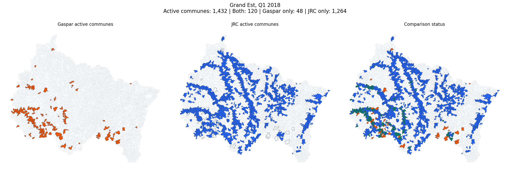
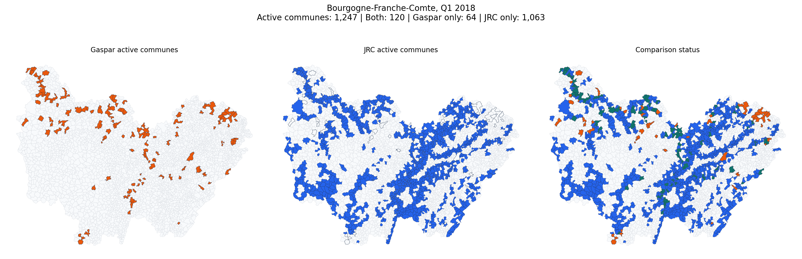
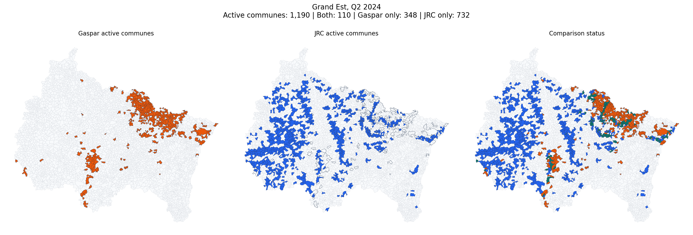

# Gaspar vs JRC in France: 2015-2024 Horizon Audit

This note extends the earlier manual-check report and documents two things:

1. the overall national match statistics already produced by the project

2. a deeper manual review of the periods where Gaspar and JRC differ the most across the `2015-2024` horizon

This report can be regenerated with [src/build_gaspar_jrc_horizon_audit_docs.py](/D:/M2_MoSEF/DataCollection/src/build_gaspar_jrc_horizon_audit_docs.py).

Project inputs and logic used here:

- [src/compare_france_jrc_gaspar_flexible.py](/D:/M2_MoSEF/DataCollection/src/compare_france_jrc_gaspar_flexible.py)

- [src/france_commune_activity.py](/D:/M2_MoSEF/DataCollection/src/france_commune_activity.py)

- [src/gaspar_jrc_france_map_app.py](/D:/M2_MoSEF/DataCollection/src/gaspar_jrc_france_map_app.py)

- `data/processed/jrc_gaspar_comparison_flexible_7d`

- `data/processed/jrc_gaspar_comparison_flexible_30d`

## 1. Overall Match Statistics

The headline event-level comparison already exists in the project output folders:

- `data/processed/jrc_gaspar_comparison_flexible_7d`
- `data/processed/jrc_gaspar_comparison_flexible_30d`

The event grain comes from the comparison code in [src/compare_france_jrc_gaspar_flexible.py](/D:/M2_MoSEF/DataCollection/src/compare_france_jrc_gaspar_flexible.py):

- `JRC event` = one `jrc_event_id`
- `Gaspar event` = one `gaspar_event_uid = cod_nat_catnat + dat_deb + dat_fin`

Important note: this means the Gaspar "event" count is a recognition-period proxy, not a perfect reconstruction of physical disaster episodes.

### National event-level coverage, commune matching rule

| Window | JRC matched | JRC exclusive | JRC total | JRC match rate | Gaspar matched | Gaspar exclusive | Gaspar total | Gaspar match rate |
| --- | ---: | ---: | ---: | ---: | ---: | ---: | ---: | ---: |
| 7 days | 66 | 222 | 288 | 22.9% | 499 | 3,006 | 3,505 | 14.2% |
| 30 days | 80 | 208 | 288 | 27.8% | 587 | 2,918 | 3,505 | 16.7% |

### National event-level coverage, department matching rule

| Window | JRC matched | JRC exclusive | JRC total | JRC match rate | Gaspar matched | Gaspar exclusive | Gaspar total | Gaspar match rate |
| --- | ---: | ---: | ---: | ---: | ---: | ---: | ---: | ---: |
| 7 days | 125 | 163 | 288 | 43.4% | 1,488 | 2,017 | 3,505 | 42.5% |
| 30 days | 171 | 117 | 288 | 59.4% | 1,886 | 1,619 | 3,505 | 53.8% |

### National commune-row coverage

| Window | JRC matched rows | JRC total rows | JRC row match rate | Gaspar matched rows | Gaspar total rows | Gaspar row match rate |
| --- | ---: | ---: | ---: | ---: | ---: | ---: |
| 7 days | 2,501 | 64,327 | 3.9% | 1,983 | 19,217 | 10.3% |
| 30 days | 3,080 | 64,327 | 4.8% | 2,204 | 19,217 | 11.5% |

### Reading

- The low commune-level event match is confirmed by the project outputs. Under the strict `7-day` rule, only `22.9%` of JRC events and `14.2%` of Gaspar event groups find a commune-level partner.
- Even with the more permissive `30-day` rule, the commune-level event match remains low: `27.8%` for JRC and `16.7%` for Gaspar.
- Department-level matching is materially higher, which means a large share of the disagreement comes from commune-level fragmentation rather than from a total absence of overlap.
- Gaspar contains `164` decree IDs but `3,505` event groups in the comparison logic, which already tells us that one administrative decree can expand into many date-specific groups.

## 2. Periods With The Largest Manual Mismatch Across 2015-2024

To extend the manual checks beyond the already documented 2021 examples, I ranked every France region-quarter from `2015-Q1` to `2024-Q4` with the same commune-activity logic used by the Streamlit app.

Important distinction:

- this ranking is based on **period-overlap commune activity**
- it is not the same as the **event-pair statistics** from the flexible comparison script

The ranking file used for this section is saved at:

- [region_quarter_mismatch_2015_2024.csv](/D:/M2_MoSEF/DataCollection/docs/assets/gaspar_jrc_horizon_audit/region_quarter_mismatch_2015_2024.csv)

### Top region-quarter combinations by disagreement communes

| Period | Region | Active communes | Both | Gaspar only | JRC only | Mismatch communes | Overlap share |
| --- | --- | --- | --- | --- | --- | --- | --- |
| 2018-Q1 | Grand Est | 1,432 | 120 | 48 | 1,264 | 1,312 | 8.4% |
| 2024-Q1 | Grand Est | 1,255 | 8 | 23 | 1,224 | 1,247 | 0.6% |
| 2018-Q1 | Bourgogne-Franche-Comte | 1,247 | 120 | 64 | 1,063 | 1,127 | 9.6% |
| 2020-Q1 | Grand Est | 1,109 | 6 | 5 | 1,098 | 1,103 | 0.5% |
| 2021-Q1 | Grand Est | 1,101 | 0 | 0 | 1,101 | 1,101 | 0.0% |
| 2024-Q2 | Grand Est | 1,190 | 110 | 348 | 732 | 1,080 | 9.2% |
| 2019-Q4 | Grand Est | 994 | 0 | 0 | 994 | 994 | 0.0% |
| 2020-Q2 | Grand Est | 956 | 1 | 8 | 947 | 955 | 0.1% |
| 2023-Q4 | Grand Est | 882 | 3 | 15 | 864 | 879 | 0.3% |
| 2024-Q1 | Occitanie | 868 | 1 | 10 | 857 | 867 | 0.1% |
| 2024-Q2 | Occitanie | 843 | 6 | 23 | 814 | 837 | 0.7% |
| 2021-Q1 | Bourgogne-Franche-Comte | 746 | 0 | 3 | 743 | 746 | 0.0% |

### Strongest Gaspar-dominant periods

| Period | Region | Active communes | Both | Gaspar only | JRC only | Mismatch communes | Overlap share |
| --- | --- | --- | --- | --- | --- | --- | --- |
| 2016-Q2 | Centre-Val de Loire | 818 | 89 | 707 | 22 | 729 | 10.9% |
| 2016-Q2 | Ile-de-France | 583 | 0 | 583 | 0 | 583 | 0.0% |
| 2018-Q2 | Nouvelle-Aquitaine | 637 | 34 | 410 | 193 | 603 | 5.3% |
| 2016-Q2 | Hauts-de-France | 366 | 0 | 363 | 3 | 366 | 0.0% |
| 2024-Q2 | Grand Est | 1,190 | 110 | 348 | 732 | 1,080 | 9.2% |
| 2016-Q2 | Grand Est | 332 | 0 | 315 | 17 | 332 | 0.0% |
| 2019-Q4 | Provence-Alpes-Cote d'Azur | 360 | 24 | 305 | 31 | 336 | 6.7% |
| 2023-Q4 | Hauts-de-France | 492 | 89 | 302 | 101 | 403 | 18.1% |

### Strongest JRC-dominant periods

| Period | Region | Active communes | Both | Gaspar only | JRC only | Mismatch communes | Overlap share |
| --- | --- | --- | --- | --- | --- | --- | --- |
| 2018-Q1 | Grand Est | 1,432 | 120 | 48 | 1,264 | 1,312 | 8.4% |
| 2024-Q1 | Grand Est | 1,255 | 8 | 23 | 1,224 | 1,247 | 0.6% |
| 2021-Q1 | Grand Est | 1,101 | 0 | 0 | 1,101 | 1,101 | 0.0% |
| 2020-Q1 | Grand Est | 1,109 | 6 | 5 | 1,098 | 1,103 | 0.5% |
| 2018-Q1 | Bourgogne-Franche-Comte | 1,247 | 120 | 64 | 1,063 | 1,127 | 9.6% |
| 2019-Q4 | Grand Est | 994 | 0 | 0 | 994 | 994 | 0.0% |
| 2020-Q2 | Grand Est | 956 | 1 | 8 | 947 | 955 | 0.1% |
| 2023-Q4 | Grand Est | 882 | 3 | 15 | 864 | 879 | 0.3% |

### Reading

- The largest mismatch periods are not concentrated in one single year; they span `2016`, `2018`, `2021`, and `2024`.
- The strongest high-activity Gaspar-dominant period is `Centre-Val de Loire, 2016-Q2`, followed by `Ile-de-France, 2016-Q2`.
- The strongest JRC-dominant periods are concentrated in the winter 2018 flood family (`Grand Est, 2018-Q1` and `Bourgogne-Franche-Comte, 2018-Q1`) and in recent Grand Est / southwest quarters at the end of the source horizon.
- Some end-of-horizon `2024` cases may be more sensitive to administrative timing lag than older quarters. That timing-lag point is an inference from the position of the period in the source horizon and from the CatNat process, not a direct measurement from the comparison tables.

## 3. Other Important Flood Periods In The 2015-2024 Horizon

The five mapped cases are not the whole story. The ranking also highlights other historically important flood periods that help explain why the national commune-level match stays low.

### Ile-de-France, Q2 2016

- Quarter: `2016-Q2`
- Profile in the ranking: Very large Gaspar-dominant quarter linked to the Seine / Loing late-May and early-June 2016 flood family.
- Active communes: `583`
- Both: `0`
- Gaspar only: `583`
- JRC only: `0`
- Overlap share: `0.0%`
- Why it matters: This period is not one of the five mapped cases because it belongs to the same national flood family as Centre-Val de Loire 2016, but it confirms that the 2016 mismatch extends well beyond one region.

Evidence links:

- [DRIEAT Ile-de-France, one year after the May-June 2016 flood](https://www.drieat.ile-de-france.developpement-durable.gouv.fr/crue-de-mai-juin-2016-le-point-un-an-apres-r1507.html)
- [Ministry of the Interior, return-experience report on May-June 2016 floods](https://www.interieur.gouv.fr/documentation/rapports/inondations-de-mai-et-juin-2016-dans-bassins-moyens-de-seine-et-de-loire-retour-dexperience-16080-r.html)

### Provence-Alpes-Cote d'Azur, Q4 2019

- Quarter: `2019-Q4`
- Profile in the ranking: Strong Gaspar-dominant quarter linked to the November 2019 floods in the Var and Alpes-Maritimes.
- Active communes: `360`
- Both: `24`
- Gaspar only: `305`
- JRC only: `31`
- Overlap share: `6.7%`
- Why it matters: This case shows that the mismatch is not limited to the northeast or to 2016. Mediterranean flood episodes also create large commune-level disagreement.

Evidence links:

- [Legifrance, CatNat recognition for the 22-24 November 2019 floods](https://www.legifrance.gouv.fr/jorf/article_jo/JORFARTI000041717653)
- [Official Rhone-Mediterranee flood-event report, Var floods of 22-24 November 2019](https://www.auvergne-rhone-alpes.developpement-durable.gouv.fr/IMG/pdf/20240606-epri-bassinrm-receuil_evts.pdf)

### Hauts-de-France, Q4 2023

- Quarter: `2023-Q4`
- Profile in the ranking: Strong Gaspar-dominant quarter linked to the November 2023 Pas-de-Calais and Nord floods.
- Active communes: `492`
- Both: `89`
- Gaspar only: `302`
- JRC only: `101`
- Overlap share: `18.1%`
- Why it matters: This recent case confirms that major flood episodes can remain strongly Gaspar-heavy even when public evidence and national response were intense.

Evidence links:

- [Hauts-de-France regional prefecture, flood situation update, 22 November 2023](https://www.prefectures-regions.gouv.fr/hauts-de-france/Actualites/Crues-dans-le-Pas-de-Calais-et-le-Nord-point-de-situation-sur-les-moyens-mobilises-au-22.11)
- [Service-Public, CatNat recognition for 205 communes after the November 2023 floods](https://www.service-public.gouv.fr/particuliers/actualites/A16928?lang=en)
- [info.gouv.fr, national government response to the Hauts-de-France floods](https://www.info.gouv.fr/actualite/le-gouvernement-se-mobilise-face-aux-inondations)

## 4. Extended Manual Checks Across 2015-2024

The manual examples below were selected to cover different mismatch profiles across the whole horizon:

- a major Gaspar-dominant flood family (`Centre-Val de Loire, 2016-Q2`)
- the two strongest JRC-dominant winter-flood corridors (`Grand Est, 2018-Q1` and `Bourgogne-Franche-Comte, 2018-Q1`)
- a mixed case with public evidence on both sides (`Grand Est, 2021-Q3`)
- a recent end-of-horizon case where both flood reality and timing effects matter (`Grand Est, 2024-Q2`)

### Centre-Val de Loire, Q2 2016

- Quarter: `2016-Q2`
- Exact window: `2016-04-01` to `2016-06-30`
- Region code: `24` (Centre-Val de Loire)
- Active communes: `818`
- Both: `89`
- Gaspar only: `707`
- JRC only: `22`
- Overlap share: `10.9%`
- Top `gaspar_only` departments in this example: 45 (237), 41 (144), 36 (123), 18 (122)
- Top `jrc_only` departments in this example: 37 (20), 41 (2)
- Why this case was selected: Chosen as the strongest high-activity Gaspar-dominant quarter in the 2015-2024 horizon.

Interpretation:

This is the strongest high-activity Gaspar-dominant period in the horizon. `gaspar_only` communes are concentrated in 45 (237), 41 (144), 36 (123), 18 (122), while the small `jrc_only` remainder is limited to 37 (20), 41 (2). The external sources clearly confirm a major late-May and early-June 2016 flood, so the weak JRC overlap is better read as a footprint and timing difference than as an absence of flooding.

Public evidence used to contextualize this case:

- [Centre-Val de Loire prefecture, regional floods page](https://www.prefectures-regions.gouv.fr/centre-val-de-loire/Actualites/Principales/Inondations-en-region-Centre-Val-de-Loire)
- [DREAL Centre-Val de Loire, return on late May / early June 2016 floods](https://www.centre-val-de-loire.developpement-durable.gouv.fr/retour-sur-les-crues-de-fin-mai-et-debut-juin-2016-a3155.html)
- [Ministry of the Interior, return-experience report on May-June 2016 floods](https://www.interieur.gouv.fr/fr/Publications/Rapports-de-l-IGA/Securite-civile/Inondations-de-mai-et-de-juin-2016-dans-les-bassins-moyens-de-la-Seine-et-de-la-Loire-retour-d-experience)
- [Loiret department, remembrance page for May-June 2016 floods](https://www.loiret.fr/actualite/inondations-de-mai-juin-2016-le-loiret-se-souvient)

### Grand Est, Q1 2018

- Quarter: `2018-Q1`
- Exact window: `2018-01-01` to `2018-03-31`
- Region code: `44` (Grand Est)
- Active communes: `1,432`
- Both: `120`
- Gaspar only: `48`
- JRC only: `1,264`
- Overlap share: `8.4%`
- Top `gaspar_only` departments in this example: 10 (32), 88 (10), 51 (2), 52 (2)
- Top `jrc_only` departments in this example: 55 (205), 57 (203), 51 (145), 54 (141)
- Why this case was selected: Chosen because it is the single largest region-quarter mismatch in the 2015-2024 ranking.

Interpretation:

This is the single largest region-quarter mismatch in the ranking. `jrc_only` communes cluster heavily in 55 (205), 57 (203), 51 (145), 54 (141), while `gaspar_only` remains limited to 10 (32), 88 (10), 51 (2), 52 (2). Official hydrology and flood-marker sources confirm generalized January 2018 flooding across the northeast, which is consistent with a very broad hydrologic event whose raster footprint is much wider than the administrative overlap.

Public evidence used to contextualize this case:

- [Meteo-France, January 2018 remarkable floods](https://meteofrance.com/magazine/meteo-histoire/les-grands-evenements/janvier-2018-inondations-et-crues-remarquables)
- [Bas-Rhin prefecture, 2018 press archive with 23 January flood bulletin](https://www.bas-rhin.gouv.fr/Actualites/Communiques-Agenda/Archive-CP/Communiques-2018)
- [Reperes de crues, Moselle January 2018 flood mark near Metz](https://www.reperesdecrues.developpement-durable.gouv.fr/repere/metz-culee-amont-rive-gauche-du-pont-d153z-2eme-pont-en-aval-de-la-confluence-avec-la-seille)
- [Rhin-Meuse flood-risk plan, generalized January 2018 flood on Meuse and Rhine basins](https://www.grand-est.developpement-durable.gouv.fr/IMG/pdf/pgri-rhin-meuse_approuve.pdf)

### Bourgogne-Franche-Comte, Q1 2018

- Quarter: `2018-Q1`
- Exact window: `2018-01-01` to `2018-03-31`
- Region code: `27` (Bourgogne-Franche-Comte)
- Active communes: `1,247`
- Both: `120`
- Gaspar only: `64`
- JRC only: `1,063`
- Overlap share: `9.6%`
- Top `gaspar_only` departments in this example: 70 (18), 21 (16), 89 (14), 25 (8)
- Top `jrc_only` departments in this example: 70 (226), 71 (198), 21 (148), 25 (132)
- Why this case was selected: Chosen as the second-largest mismatch quarter and as the neighboring winter-flood corridor to the Grand Est 2018 case.

Interpretation:

This neighboring winter 2018 case is also strongly JRC-dominant. `jrc_only` communes are concentrated in 70 (226), 71 (198), 21 (148), 25 (132), whereas `gaspar_only` is much smaller in 70 (18), 21 (16), 89 (14), 25 (8). The regional hydrology bulletin and prefecture alerts confirm two January 2018 flood sequences, so the pattern again looks like a very wide flood corridor with limited administrative overlap.

Public evidence used to contextualize this case:

- [Bourgogne-Franche-Comte hydrological bulletin, special January 2018 flood issue](https://www.bourgogne-franche-comte.developpement-durable.gouv.fr/IMG/pdf/bull_bfc_01_2018_cle11613d.pdf)
- [Doubs prefecture, orange flood vigilance, 23 January 2018](https://www.doubs.gouv.fr/layout/set/print/Publications/Salle-de-Presse/Communiques-de-presse/Annee-2018/Le-Doubs-place-en-vigilance-orange-inondations)
- [Saone-et-Loire prefecture, orange flood vigilance point, 25 January 2018](https://www.saone-et-loire.gouv.fr/Actualites/Salle-de-presse/L-historique-des-annees-precedentes/2018/Janvier/Alerte-crues-vigilance-orange-en-Saone-et-Loire-point-de-situation)
- [Ministry of the Interior, late January 2018 floods and CatNat recognition](https://www.interieur.gouv.fr/archive/inondations-de-fin-janvier-2018-275-communes-reconnues-en-etat-de-catastrophe-naturelle)

### Grand Est, Q3 2021

- Quarter: `2021-Q3`
- Exact window: `2021-07-01` to `2021-09-30`
- Region code: `44` (Grand Est)
- Active communes: `829`
- Both: `95`
- Gaspar only: `202`
- JRC only: `532`
- Overlap share: `11.5%`
- Top `gaspar_only` departments in this example: 54 (45), 55 (41), 52 (34), 57 (29)
- Top `jrc_only` departments in this example: 55 (104), 57 (85), 51 (78), 08 (70)
- Why this case was selected: Chosen as a mixed July 2021 case where both Gaspar-only and JRC-only clusters are supported by public evidence.

Interpretation:

This remains a mixed case rather than a single-source extreme. `jrc_only` communes cluster mainly in 55 (104), 57 (85), 51 (78), 08 (70), while `gaspar_only` communes are strongest in 54 (45), 55 (41), 52 (34), 57 (29). Because public evidence exists on both sides, this example is especially useful for showing that the mismatch is not just noise or unmatched commune codes.

Public evidence used to contextualize this case:

- [L'Est Republicain, Bar-le-Duc under water, 15 July 2021](https://www.estrepublicain.fr/faits-divers-justice/2021/07/15/inondations-spectaculaires-a-bar-le-duc-la-ville-toute-une-journee-les-pieds-dans-l-eau)
- [Meuse prefecture, July 13-15 2021 flood procedure](https://www.meuse.gouv.fr/Politiques-publiques/Securite/Demande-de-catastrophes-naturelles-Inondations-du-13-au-15-juillet-2021)
- [Champagne FM, Asfeld pumping operations, 14 July 2021](https://www.champagnefm.com/news/a-deborde-56670)
- [Radio 8 Ardennes, flood situation update, 16 July 2021](https://radio8fm.com/infos/article/16614-Pluie_inondations_Point_de_situation_dans_les_Ardennes_ce_16_juillet_2021_a_19h00)
- [Reperes de crues, Vieux-les-Asfeld](https://www.reperesdecrues.developpement-durable.gouv.fr/site/sortie-du-village-en-direction-de-avaux)

### Grand Est, Q2 2024

- Quarter: `2024-Q2`
- Exact window: `2024-04-01` to `2024-06-30`
- Region code: `44` (Grand Est)
- Active communes: `1,190`
- Both: `110`
- Gaspar only: `348`
- JRC only: `732`
- Overlap share: `9.2%`
- Top `gaspar_only` departments in this example: 57 (227), 67 (44), 52 (39), 54 (16)
- Top `jrc_only` departments in this example: 51 (186), 10 (156), 55 (106), 08 (70)
- Why this case was selected: Chosen as a recent end-of-horizon case with very large mismatch and clear public evidence from the May 17-20, 2024 flood episode.

Interpretation:

This recent case combines `1,190` active communes and `1,080` disagreement communes. `jrc_only` dominates in 51 (186), 10 (156), 55 (106), 08 (70), but Gaspar-only pockets remain visible in 57 (227), 67 (44), 52 (39), 54 (16). Public sources clearly confirm the 17-20 May 2024 flood episode in Moselle and northern Alsace. It is also plausible that some of the remaining mismatch reflects administrative timing lag at the end of the 2015-2024 source horizon; that lag explanation is an inference from the timing context, not a direct measurement from the comparison tables.

Public evidence used to contextualize this case:

- [Ecology ministry press release on Grand Est floods, 18 May 2024](https://www.ecologie.gouv.fr/presse/inondations-grand-est-christophe-bechu-appelle-vigilance-habitants-rappelle-bons)
- [Moselle prefecture, accelerated CatNat procedure for May 2024 floods](https://www.moselle.gouv.fr/Actualites/Securite/Protection-publique-et-securite-civile/Inondations-mai-2024-Procedure-de-reconnaissance-de-l-Etat-de-catastrophe-naturelle-acceleree)
- [DREAL Grand Est hydrological bulletin, May 2024](https://www.grand-est.developpement-durable.gouv.fr/bsh-grand-est-mai-2024-a22699.html)
- [Moselle state services, after-action note on the May 2024 floods](https://www.moselle.gouv.fr/Publications/Actu-Moselle-Le-magazine-de-l-Etat-en-Moselle/Annee-2024/La-lettre-des-services-de-l-Etat-en-Moselle-n-67/La-Moselle-frappee-par-les-inondations)

## 5. Why The Match Rate Stays Low

- `Gaspar` and `JRC` do not encode the same object. Gaspar is an administrative recognition system, while JRC is a flood-footprint system derived from satellite products and related processing.
- A large flood can fragment differently across the two sources in both space and time.
- The region-quarter ranking shows that the mismatch is not confined to one famous event. It reappears in different hydrologic contexts: the late-May / early-June 2016 floods, the winter 2018 flood family, the July 2021 northeast floods, and the May 2024 Grand Est floods.
- The department-level event match is much higher than the commune-level event match, which means that a large share of the disagreement comes from fine-grained commune allocation and timing segmentation.
- The 2024 case also suggests that end-of-horizon administrative timing may amplify the mismatch in some recent quarters. This is an inference from the source horizon and the CatNat process, not a direct measurement from the overlap tables.

## 6. Main Conclusion

The low national Gaspar/JRC match rate is real, and the extended manual checks show that it persists across multiple important flood families between 2015 and 2024. The evidence is most consistent with a combination of different event concepts, different spatial footprints, commune-level fragmentation, and in some recent quarters possibly administrative timing lag as well.
