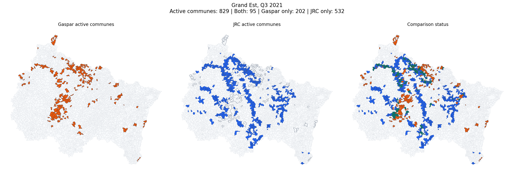
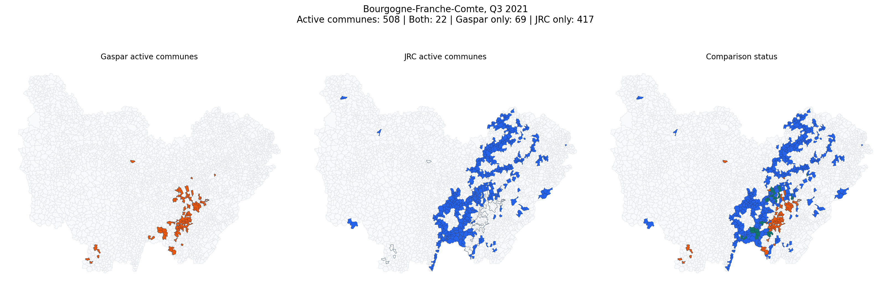
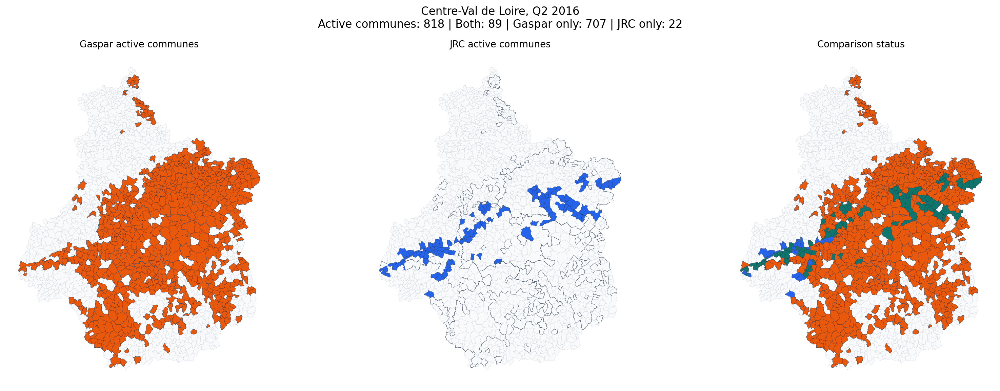

# Gaspar vs JRC in France: Match Statistics and Manual Visual Checks

This note documents two things:

1. national match statistics from the existing France comparison outputs

2. manual quarter-region visual checks based on the France commune activity map logic

This report can be regenerated with [src/build_gaspar_jrc_match_audit_docs.py](/D:/M2_MoSEF/DataCollection/src/build_gaspar_jrc_match_audit_docs.py).

Project inputs and logic used here:

- [src/compare_france_jrc_gaspar_flexible.py](/D:/M2_MoSEF/DataCollection/src/compare_france_jrc_gaspar_flexible.py)

- [src/france_commune_activity.py](/D:/M2_MoSEF/DataCollection/src/france_commune_activity.py)

- [src/gaspar_jrc_france_map_app.py](/D:/M2_MoSEF/DataCollection/src/gaspar_jrc_france_map_app.py)

- `data/processed/jrc_gaspar_comparison_flexible_7d`

- `data/processed/jrc_gaspar_comparison_flexible_30d`

## 1. Overall Match Statistics

The headline event-level comparison already exists in the project output folders:

- `data/processed/jrc_gaspar_comparison_flexible_7d`
- `data/processed/jrc_gaspar_comparison_flexible_30d`

The event grain comes from the comparison code in [src/compare_france_jrc_gaspar_flexible.py](/D:/M2_MoSEF/DataCollection/src/compare_france_jrc_gaspar_flexible.py):

- `JRC event` = one `jrc_event_id`
- `Gaspar event` = one `gaspar_event_uid = cod_nat_catnat + dat_deb + dat_fin`

Important note: this means the Gaspar "event" count is a recognition-period proxy, not a perfect reconstruction of physical disaster episodes.

### National event-level coverage, commune matching rule

| Window | JRC matched | JRC exclusive | JRC total | JRC match rate | Gaspar matched | Gaspar exclusive | Gaspar total | Gaspar match rate |
| --- | ---: | ---: | ---: | ---: | ---: | ---: | ---: | ---: |
| 7 days | 66 | 222 | 288 | 22.9% | 499 | 3,006 | 3,505 | 14.2% |
| 30 days | 80 | 208 | 288 | 27.8% | 587 | 2,918 | 3,505 | 16.7% |

### National event-level coverage, department matching rule

| Window | JRC matched | JRC exclusive | JRC total | JRC match rate | Gaspar matched | Gaspar exclusive | Gaspar total | Gaspar match rate |
| --- | ---: | ---: | ---: | ---: | ---: | ---: | ---: | ---: |
| 7 days | 125 | 163 | 288 | 43.4% | 1,488 | 2,017 | 3,505 | 42.5% |
| 30 days | 171 | 117 | 288 | 59.4% | 1,886 | 1,619 | 3,505 | 53.8% |

### National commune-row coverage

| Window | JRC matched rows | JRC total rows | JRC row match rate | Gaspar matched rows | Gaspar total rows | Gaspar row match rate |
| --- | ---: | ---: | ---: | ---: | ---: | ---: |
| 7 days | 2,501 | 64,327 | 3.9% | 1,983 | 19,217 | 10.3% |
| 30 days | 3,080 | 64,327 | 4.8% | 2,204 | 19,217 | 11.5% |

### Reading

- The low commune-level event match is confirmed by the project outputs. Under the strict `7-day` rule, only `22.9%` of JRC events and `14.2%` of Gaspar event groups find a commune-level partner.
- Even with the more permissive `30-day` rule, the commune-level event match remains low: `27.8%` for JRC and `16.7%` for Gaspar.
- Department-level matching is materially higher, which means a large share of the disagreement comes from commune-level fragmentation rather than from a total absence of overlap.
- Gaspar contains `164` decree IDs but `3,505` event groups in the comparison logic, which already tells us that one administrative decree can expand into many date-specific groups.

## 2. Manual Visual Checks

These checks use the commune-activity logic from [src/france_commune_activity.py](/D:/M2_MoSEF/DataCollection/src/france_commune_activity.py) and the France map workflow from [src/gaspar_jrc_france_map_app.py](/D:/M2_MoSEF/DataCollection/src/gaspar_jrc_france_map_app.py).

Important distinction:

- the national statistics above are event-pair statistics from the flexible comparison script
- the manual maps below are period-overlap commune activity maps

So the two sections are related, but they do not measure exactly the same object.

### Grand Est, Q3 2021

- Quarter: `2021-Q3`
- Region code: `44` (Grand Est)
- Active communes: `829`
- Both: `95`
- Gaspar only: `202`
- JRC only: `532`
- Top `gaspar_only` departments in this example: 54 (45), 55 (41), 52 (34), 57 (29)
- Top `jrc_only` departments in this example: 55 (104), 57 (85), 51 (78), 08 (70)

This is a July 2021 heavy-impact example with substantial communes in all three classes. It is useful for checking whether the mismatch is a pure data error or a real difference in how the two sources represent the same flood episode.

Interpretation:

The mismatch is not random. `jrc_only` communes cluster mainly in departments 55 (104), 57 (85), 51 (78), 08 (70), while `gaspar_only` communes are strongest in 54 (45), 55 (41), 52 (34), 57 (29). The overlap zone exists, but it is much smaller than the two source-specific clusters, which suggests that both sources are seeing the same broad northeast flood episode with different commune footprints.

Public evidence used to contextualize this case:

- [L'Est Republicain, Bar-le-Duc under water, 15 July 2021](https://www.estrepublicain.fr/faits-divers-justice/2021/07/15/inondations-spectaculaires-a-bar-le-duc-la-ville-toute-une-journee-les-pieds-dans-l-eau)
- [Meuse prefecture, July 13-15 2021 flood procedure](https://www.meuse.gouv.fr/Politiques-publiques/Securite/Demande-de-catastrophes-naturelles-Inondations-du-13-au-15-juillet-2021)
- [Champagne FM, Asfeld pumping operations, 14 July 2021](https://www.champagnefm.com/news/a-deborde-56670)
- [Radio 8 Ardennes, flood situation update, 16 July 2021](https://radio8fm.com/infos/article/16614-Pluie_inondations_Point_de_situation_dans_les_Ardennes_ce_16_juillet_2021_a_19h00)
- [Reperes de crues, Vieux-les-Asfeld](https://www.reperesdecrues.developpement-durable.gouv.fr/site/sortie-du-village-en-direction-de-avaux)

### Bourgogne-Franche-Comte, Q3 2021

- Quarter: `2021-Q3`
- Region code: `27` (Bourgogne-Franche-Comte)
- Active communes: `508`
- Both: `22`
- Gaspar only: `69`
- JRC only: `417`
- Top `gaspar_only` departments in this example: 39 (63), 71 (5), 21 (1)
- Top `jrc_only` departments in this example: 70 (153), 71 (102), 39 (68), 25 (63)

This neighboring July 2021 example is strongly JRC-dominant, but still contains Gaspar-only pockets. It is useful because the public evidence already shows flood impacts both in the Jura side and in the Haute-Saone side.

Interpretation:

This case is strongly JRC-dominant. `jrc_only` communes are concentrated in 70 (153), 71 (102), 39 (68), 25 (63), whereas `gaspar_only` is concentrated almost entirely in 39 (63), 71 (5), 21 (1). Visually, JRC spreads over a wider corridor than Gaspar, which is consistent with a floodplain or hydrologic footprint extending beyond the set of communes that entered administrative recognition.

Public evidence used to contextualize this case:

- [Le Progres, Jura floods, 16 July 2021](https://www.leprogres.fr/environnement/2021/07/16/inondations-glissement-de-terrain-le-departement-prend-l-eau)
- [Le Progres, Jura floods, 17 July 2021](https://www.leprogres.fr/environnement/2021/07/17/inondations-trois-cents-appels-en-une-heure-trente)
- [Official Rhone-Mediterranee basin event report](https://www.auvergne-rhone-alpes.developpement-durable.gouv.fr/IMG/pdf/20240606-epri-bassinrm-receuil_evts.pdf)
- [Legifrance decree of 23 July 2021](https://www.legifrance.gouv.fr/jorf/id/JORFSCTA000043879099)
- [L'Est Republicain, Autet cleanup, 25 July 2021](https://www.estrepublicain.fr/environnement/2021/07/25/nettoyage-apres-l-invasion-d-eau)

### Centre-Val de Loire, Q2 2016

- Quarter: `2016-Q2`
- Region code: `24` (Centre-Val de Loire)
- Active communes: `818`
- Both: `89`
- Gaspar only: `707`
- JRC only: `22`
- Top `gaspar_only` departments in this example: 45 (237), 41 (144), 36 (123), 18 (122)
- Top `jrc_only` departments in this example: 37 (20), 41 (2)

This is a Gaspar-dominant case linked to the major late-May and early-June 2016 floods. It is a useful counter-example because it shows that some very large recognized events still produce weak JRC matching at commune level.

Interpretation:

This case is strongly Gaspar-dominant. `gaspar_only` communes are concentrated in 45 (237), 41 (144), 36 (123), 18 (122), while the small `jrc_only` remainder is limited to 37 (20), 41 (2). The visual reading is that a very large administratively recognized event exists, but JRC only overlaps a narrower subset of the affected communes.

Public evidence used to contextualize this case:

- [Centre-Val de Loire prefecture, regional floods page](https://www.prefectures-regions.gouv.fr/centre-val-de-loire/Actualites/Principales/Inondations-en-region-Centre-Val-de-Loire)
- [DREAL Centre-Val de Loire, return on late May / early June 2016 floods](https://www.centre-val-de-loire.developpement-durable.gouv.fr/retour-sur-les-crues-de-fin-mai-et-debut-juin-2016-a3155.html)
- [Ministry of the Interior, return-experience report on May-June 2016 floods](https://www.interieur.gouv.fr/documentation/rapports/inondations-de-mai-et-juin-2016-dans-bassins-moyens-de-seine-et-de-loire-retour-dexperience-16080-r.html)
- [Loiret department, remembrance page for May-June 2016 floods](https://www.loiret.fr/actualite/inondations-de-mai-juin-2016-le-loiret-se-souvient)

## 3. Why the Match Rate Is Low

- `Gaspar` and `JRC` do not start from the same event concept. Gaspar is an administrative recognition system, while JRC is a flood-footprint system derived from satellite-based products.
- A single physical episode can be fragmented differently in the two sources across communes and across dates.
- Commune-level matching is especially hard because one side may recognize runoff, mudflow, or localized urban flooding while the other side captures a wider floodplain footprint.
- The department-level rates show that overlap exists, but the overlap becomes much weaker once the comparison is forced down to the commune-event grain.
- The Gaspar commune harmonization logic matters, but it is not the main explanation here. The unresolved Gaspar share in the map app is small relative to the scale of the national mismatch.

## 4. Main Conclusion

The low national match rate is real in the project outputs, and the manual checks suggest that it is not just a cleaning bug. The disagreement mainly reflects differences in event grain, timing fragmentation, and spatial support between an administrative recognition database and a satellite-oriented flood extent product.
